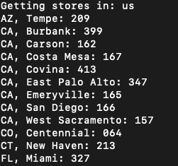
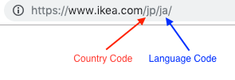
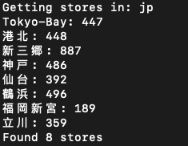
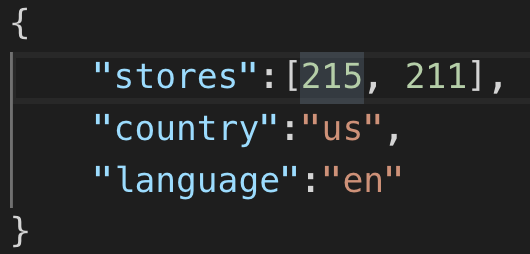
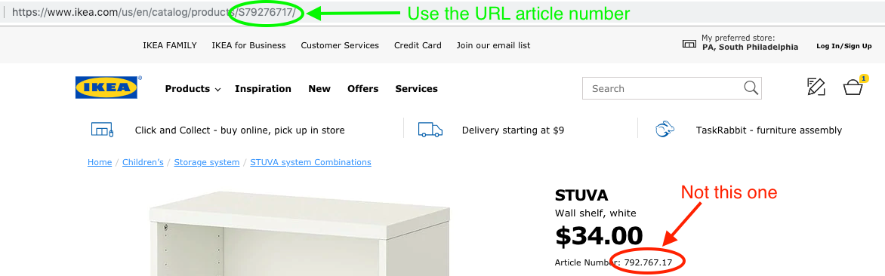
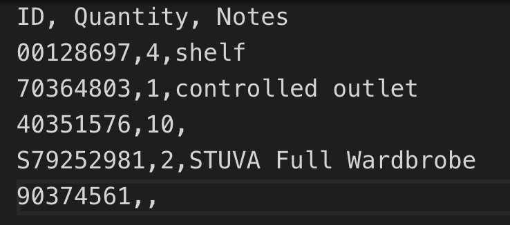
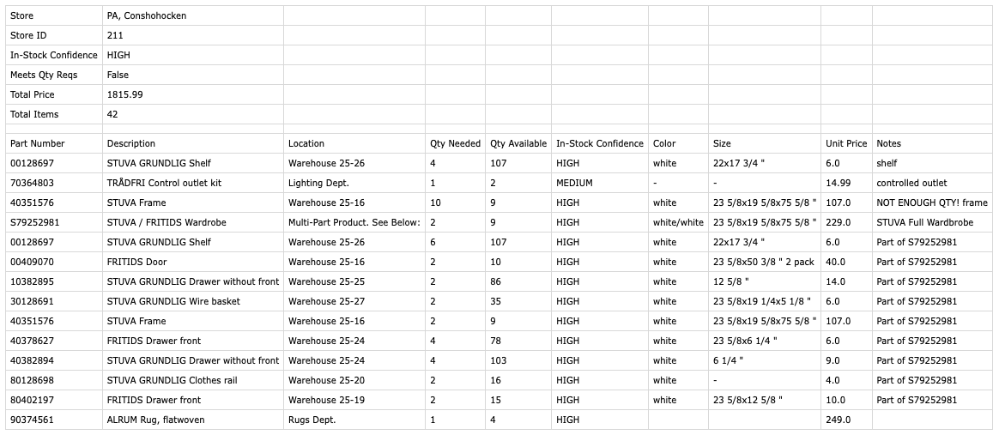

# IKEA Stock Check

A super convenient way to make a shopping list for IKEA. For specified IKEA article numbers, this script checks the stock and provides the aisle and bin locations for stores nearby. 

## Installation

* Install [Python 3](https://www.python.org/) on your system (or check that it is installed and enabled in your environment)
* Clone this repository and navigate to the downloaded directory
* In your terminal: `pip install -r requirements.txt`

## Set Preferred Stores

* If you are in the U.S., run `python get_stores.py` (or `python3 get_stores.py`)

   

* Otherwise, figure out your 2-digit country code and language code. You can find this by going to your country's IKEA website. In the URL [https://www.ikea.com/jp/ja/](https://www.ikea.com/jp/ja/), 'jp' is the country code and 'ja' is the language code. Then run the same program with your country code, e.g. `python get_stores.py jp`.

   

   

* Find your preferred store(s) and note their 3-digit codes. For example, the store in PA, South Philadelphia has the code 215.
* Edit the file preferred_stores.json with your preferred stores, language code, and country code. If you have just one preferred store, remove the comma but keep the brackets, e.g. [215]

   

## Check Stock and Locations

* Find the article numbers of the items you would like to purchase. They can be recorded with or without the period separators (e.g. 202.813.82 and 20281382 are both valid). 

   **However,** I recommend copying the item code from the product's URL, as it sometimes differs from the article number listed on the site. For example, the article number for the [STUVA wall shelf](https://www.ikea.com/us/en/catalog/products/S79276717/) is 792.767.17, but the URL specifies it as S79276717. Only the number from the URL (S79276717) works in the IKEA API.

   

* Edit the file in.csv with the item id(s). (Optionally, include the quantity you need, and any notes. If you do not include a quantity, it will be assumed as 1.) 

   

   **Note:** I recommend editing the CSV file in a text editor (e.g. Notepad, TextEdit, or [Visual Studio Code](https://code.visualstudio.com/)) and not Microsoft Excel, as Excel likes to play with formatting. You must include two commas on every line.

* Run the script: `python check_stock.py`. You'll see the status of the script, as well as any errors if they arise. When the script is finished, you'll have a CSV file for each store, saved as out_[store name].csv. This is what it looks like:

A few things to note about the output file:
* 'In-Stock Confidence' is the probability at least qty 1 will still be in stock when you arrive at the store
* 'Meets Qty Reqs' will show True if the store has your desired quantity for every item on the list, False if not
* Any items that are short on quantity will show NOT ENOUGH QTY! in the notes section
* Total items is the total number of items you should have in your cart at the end of the trip
* Total Price is the total price of the cart, not including IKEA Family pricing
* For multi-piece items, each item will be broken down into a separate line item, as these are often located in different areas of the store. The quantity is updated based on how many you need

## Caveats

* There are almost definitely bugs with this script! I'm fixing them as I encounter them. If you notice anything, please open an issue or submit a pull request.
* Please don't run a large number of requests (100s per hour or day). The API provided by IKEA was really only meant for their own website, and they might not be happy with a large quantity of requests.
* The IKEA API could change at any time. It may also differ by country. I've only tested this in the U.S.
* I've only tested this with Python 3.7 on Mac.

## Need Help?

Please open an issue on this repository or [contact me](https://gregyeutter.com/connect).

## Was this project useful?

Consider [buying me a coffee](https://buymeacoff.ee/gregyeutter) or [donating via PayPal](https://www.paypal.me/gregyeutter/).

## License

This project is distributed under the [MIT license](/LICENSE).
